# Balance changes comparing current WG to Lesta params

!!! warning
    This page is still WIP, it can be lacking some tanks. 
    Nations missing:  China,  Japan,  Poland,  Sweden,  Italy

!!! tip "Additional information"
    All tanks in here are sorted by the nation. Click on the nation you are looking for to show the rebalances in that nation. 
    The page is currenlty containing only tier X tech tree and Steel Hunter vehicles.
    We are comparing **WG to Lesta stats** on this page.

!!! example "Good to know"
    *f/s/b* stands for *Front/Side/Back* 
    *h/m/s* stands for *Hard/Medium/Soft*
    

## USSR
??? spoiler " USSR"
    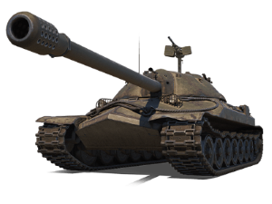 
    **IS-7**  
    *Gun* 
    **DPM** 2 238  **2 421** 
    **Damage** 490  **530** 
    **Premium shell penetration** 303  **316** 
    ---
    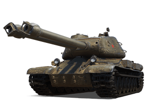 
    **ST-II**  
    *Gun* 
    **DPM** 2 459  **2 353** 
    **Reload time** 10.74  **11.22** 
    **Premium shell penetration** 310  **320** 
    **Turret traverse** 23.99  **27.12**  
    *Health and armor* 
    **Hull armor (f/s/b)** 150/140/100  **160/140/100** 
    **Turret armor (f/s/b)** 325/160/160  **300/160/160**  
    *Mobility* 
    **Forward top speed (h/m/s)** 38.4/28.8/17.1  **40/40/25.2** 
    **Reverese speed** 13  **15** 
    **Terrain resistance (hard)** 1.15  **0.67** 
    **Terrain resistance (medium)** 1.53  **1.06** 
    **Terrain resistance (soft)** 2.59  **1.75** 
    **Tank traverse (h/m/s)** 27.1/17.3/10.4  **27.1/20.3/12.1** 
    ---
    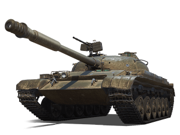 
    **Object 140**  
    *Health and armor* 
    **HP** 1 900  **2 050** 
    **Hull armor (f/s/b)** 110/80/55  **120/80/55**  
    *Mobility* 
    **Forward top speed (h/m/s)** 55/55/43.2  **55/55/55** 
    **Power/weight** 17.03  **20** 
    **Terrain resistance (hard)** 0.53  **0.17** 
    **Terrain resistance (medium)** 0.62  **0.50** 
    **Terrain resistance (soft)** 1.44  **0.96** 
    **Tank traverse (h/m/s)** 53.5/45.3/19.6  **53.5/18/9.5** 
    ---
    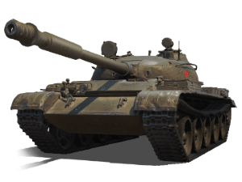 
    **T-62A**  
    *Gun* 
    **DPM** 3 034  **3 214** 
    **Damage** 320  **360** 
    **Reload time** 6.33  **6.72** 
    **Dispersion** 0.33   **0.31**  
    *Mobility* 
    **Forward speed** 50  **57** 
    **Forward top speed (h/m/s)** 50/50/45.1  **57/57/55.1** 
    **Power/weight** 16.57  **20.27**  
    *Other* 
    **Stationary camo** 15.28  **17.95** 
    **Moving camo** 11.46  **13.45** 
    ---
    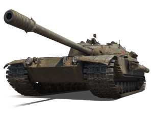 
    **K-91**  
    *Gun* 
    **DPM** 3 513  **3 179** 
    **Reload time** 5.47  **6.04** 
    **Dispersion** 0.32  **0.29** 
    **Moving dispersion** 0.14  **0.10** 

## Germany
??? spoiler " Germany"
    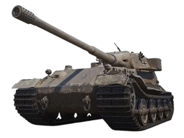 
    **Pz.Kpfw. VII**  
    *Gun* 
    **DPM** 2 190  **2 384** 
    **Reload time** 15.34  **14.09** 
    **Standard shell penetration** 276  **258** 
    **Premium shell penetration** 325  **315** 
    **Dispersion** 0.32  **0.35**  
    *Mobility* 
    **Power/weight** 11.25  **10.57** 
    **Forward top speed (h/m/s)** 33/33/18.6  **33/33/17.5** 
    ---
    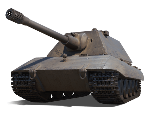 
    **E 100**  
    *Stock gun* 
    **Dispersion** 0.35  **0.37** 
    **Turret armor (f/s/b)** 280/150/150  **270/150/150** 
    **Turret traverse** 22.95  **20.86** 
## USA
??? spoiler " USA"
    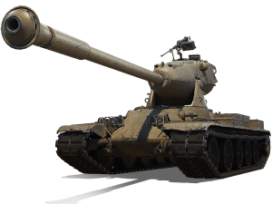 
    **M-V-Y**  
    *Stock gun* 
    **DPM** 2 764  **2 834** 
    **Reload time** 7.81  **7.62** 
    **Premium shell penetration** 315  **320** 
    **Turret traverse** 38.59  **33.38**  
    *Top gun* 
    **DPM** 2 598  **2 503** 
    **Reload time** 10.16  **10.55** 
    **Standard shell penetration** 260  **252** 
    **Premium shell penetration** 310  **300** 
    **Dispersion** 0.35  **0.37** 
    **Turret traverse dispersion** 0.08  **0.10** 
    **Turret traverse** 38.59  **33.38**  
    *Mobility* 
    **Forward speed** 40  **45** 
    **Forward top speed (h/m/s)** 40/40/29.7  **45/45/32.5** 
    **Reverse speed** 17  **15** 
    **Power/weight** 18.75  **20.50** 
    ---
    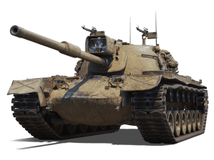 
    **M48 Patton**  
    *Gun* 
    **Aim time** 1.73  **1.82** 
    **Dispersion** 0.34  **0.35** 
    **Moving dispersion** 0.10  **0.08** 
    **Tank traverse dispersion** 0.10  **0.08**  
    *Health and armor* 
    **HP** 2 000  **2 200**  
    *Mobility* 
    **Forward speed** 48  **50** 
    **Forward top speed (h/m/s)** 48/48/42.5  **50/50/39.8** 
    **Power/weight** 20.12  **18.83**  
    *Other* 
    **Stationary camo** 8.26  **12.83** 
    **Moving camo** 6.21  **9.58**

## France
??? spoiler " France"
    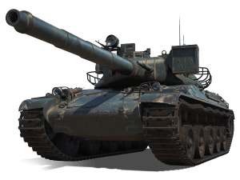 
    **AMX 30 B**  
    *Gun* 
    **DPM** 3 129  **3 348** 
    **Damage** 390  **420** 
    **Reload time** 7.48  **7.53** 
    **Standard shell velocity** 1 100  **1 300** 
    **Premium shell velocity** 800  **1 000** 
    ---
    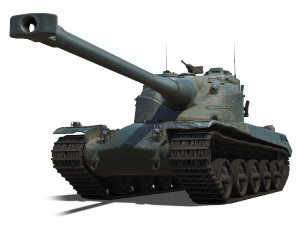 
    **AMX 50 B**  
    *Gun* 
    **DPM** 2 647  **2 618** 
    **Reload time (clip)** 28.76  **29.16** 
    **Aim time** 2.40  **2.21** 
    **Dispersion** 0.34  **0.32**  
    *Health and armor* 
    **HP** 2 100  **2 300** 

## United Kingdom
??? spoiler " United Kingdom"
    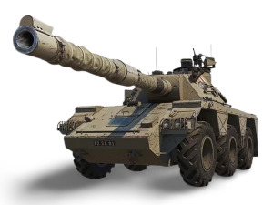 
    **Concept 5**  
    *Gun* 
    **DPM** 2 300  **2 609** 
    **Reload time** 11.22  **9.89** 
    **Aim time** 1.73  **1.82** 
    **Dispersion** 0.30  **0.31** 
    **Moving dispersion** 0.10  **0.11** 
    **Tank traverse dispersion** 0.10  **0.11**  
    *Mobility* 
    **Forward speed** 65  **70** 
    **Forward top speed (h/m/s)** 65/65/49.2  **70/70/70** 
    **Power/weight** 25.22  **29.57** 
    **Terrain resistance (hard)** 0.96  **0.12** 
    **Terrain resistance (medium)** 1.29  **0.12** 
    **Terrain resistance (soft)** 1.87  **0.12** 
    **Tank traverse** 41.72  **67.80** 
    **Tank traverse (h/m/s)** 39.6/29.4/20.3  **64.4/64.4/64.4** 
    ---
    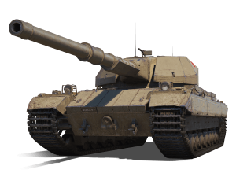 
    **Super Conqueror**  
    *Gun* 
    **DPM** 2 608  **2 635** 
    **Reload time** 9.20  **9.11**  
    *Health and armor* 
    **HP** 2 300  **2 400**

## Czechoslovakia
??? spoiler " Czechoslovakia"
    No changes were made in this nation :(
## China
??? spoiler " China"

## Japan
??? spoiler " Japan"

## Poland
??? spoiler " Poland"

## Sweden
??? spoiler " Sweden"

## Italy
??? spoiler " Italy"

## Steel Hunter
??? spoiler " Steel Hunter"
    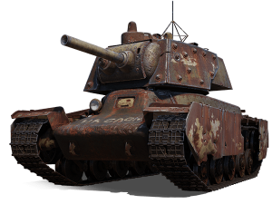 
     **Varyag**  
    *Abilities* 
    ***Minefield:***  Mines have no flags attached to them so they are harder to see. 
    ***Recovery Zone:***  Heals significantly less.  
     
    *Gun* 
    **DPM (with Standard ammo)** 2 816  **2 927** 
    **Reload time** 5.75  **5.94** 
    **Damage (standard/premium)** 270/215  **290/235**  
    *Health and armor* 
    **HP** 1 300  **1 600**  
    *Mobility* 
    **Forward speed** 40  **35** 
    **Forward top speed (h/m/s)** 40/40/39.5  **35/35/35** 
    **Power/weight** 22.86  **21.71**  
     
    *Dynamics* 
    **Forward speed** 40  **35** 
    **Engine power** 1 580  **1 500**  
    *Top speed* 
    **Forward speed** 50  **45** 
    **Engine power** 1 270  **1 206**  
     
    *Double gun* 
    **DPM (with Standard ammo)** 3 233  **3 129** 
    **Damage (standard/premium)** 310/250  **300/240**  
    *Damage per shot* 
    **DPM (with Standard ammo)** 2 865  **3 302** 
    **Reload time** 7.96  **6.9**  
     
    *Hitpoints* 
    **HP boost** 700  **600** 
    *Armor* 
    **HP boost** 400  **300**  
     
    *Rotation speed* 
    **HP boost** 500  **600**  
    *Armor* 
    **HP boost** 300  **400**  
     
    *Reload speed* 
    **DPM** (with Standard ammo) 3 933  **3 865** 
    **Damage** (standard/premium) 440/350  **420/330** 
    **Reload time** 6.71  **6.52**  
    *Double gun* 
    **DPM** (with Standard ammo) 3 681  **3 663** 
    **Damage** 500/400  **480/380** 
    **Reload time** 8.15/8.15  **7.86/7.86**  
    *Damage per shot* 
    **DPM** (with Standard ammo) 3 817  **3 861** 
    **Damage** (standard/premium) 610/490  **580/460** 
    **Reload time** 9.59  **9.01**
    ---
    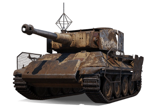 
     **Walküre**  
    *Abilities* 
    ***Repair Zone:***  Heals significantly less.  
     
    *Gun* 
    **DPM (with Standard ammo)** 2 682  **2 884** 
    **Damage (standard/premium)** 300/240  **295/235** 
    **Reload time** 6.71  **6.14**  
    *Health and armor* 
    **HP** 1300  1600  
     
    *Reload speed* 
    **DPM (with Standard ammo)** 2 950  **3 032** 
    **Penetration (standard/premium)** 170/210  **160/200** 
    **Damage (standard/premium)** 330/265  **315/250** 
    **Reload time** 6.71  6.23  
    *Damage per shot* 
    **DPM (with Standard ammo)** 2 878  **3 059** 
    **Penetration (standard/premium)** 170/210  **160/200** 
    **Damage (standard/premium)** 460/370  **440/350**  
      
    *Armor* 
    **HP boost** 400  **300**  
     
    *Hitpoints* 
    **HP boost** 500  **800**  
    *Armor* 
    **HP boost** 300  **500**  
     
    *Autoloader* 
    **DPM (with Standard ammo)** 3 835  **3 622** 
    **Damage (standard/premium)** 365/290  **355/280** 
    **Intra-clip reload** 2.5  **2.73**  
    *Reload speed* 
    **DPM (with Standard ammo)** 3 833  **3 754** 
    **Damage (standard/premium)** 490/390  **480/380**  
    *Damage per shot* 
    **Damage (standard/premium)** 720/575  **690/545** 
    **Reload time** 11.51  **11.03**
    ---
    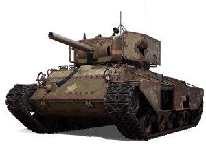 
     **Raven**  
     
    *Gun* 
    **DPM (with Standard ammo)** 3 363  **3 274** 
    **Damage (standard/premium)** 215/170  **225/180** 
    **Reload time** 3.84  **4.12**  
    *Health and armor* 
    **HP** 1 200  **1 300**  
     
    *Autoloader* 
    **DPM (with Standard ammo)** 3 459  **3 837** 
    **Damage (standard/premium)** 215/170  **225/180** 
    **Reload time** 10.64  **9.59**  
    *Reload speed* 
    **DPM (with Standard ammo)** 3 504  **3 927** 
    **Damage (standard/premium)** 280/225  **295/235** 
    **Reload time** 4.79  **4.51**  
     
    *Rotation speed* 
    **HP boost** 500  **600**  
    Armor 
    **HP boost** 500  **600**  
     
    *Reload speed* 
    **DPM (with Standard ammo)** 4 278  **5 026** 
    **Damage (standard/premium)** 350/280  **360/290** 
    **Reload time** 4.31  **4.41**  
    *Autoloader* 
    **DPM (with Standard ammo)** 4 278  **5 026** 
    **Damage (standard/premium)** 350/280  **375/300**  
    *Damage per shot* 
    **DPM (with Standard ammo)** 4 693  **5 028** 
    **Reload time** 5.75  **5.37** 
    ---
    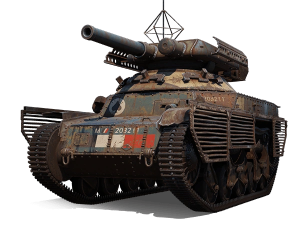 
     **Arlequin**  
    *Abilities* 
    ***Airstrike:***  Still does little splash damage, but stuns you for 30 s and can destroy your tracks.  
     
    *Gun* 
    **DPM (with Standard ammo)** 3 031  **3 344** 
    **Penetration (standard/premium)** 100/125  **110/140** 
    **Reload time** 3.07  **2.78** 
    **Shell velocity (standard/premium)** 1 000/1 200  **600/900**  
    *Health and armor* 
    **HP** 1 050  **1 000**  
     
    *Double gun* 
    **DPM (with Standard ammo)** 2 503  **3 754** 
    **Penetration (standard/premium)** 155/191  **170/220** 
    **Reload time** 7.19/7.19  **4.79/4.79** 
    **Charge time** 1  **1.5** 
    **Shell velocity (standard/premium)** 1 000/1 200  **600/900**  
    *Autoloader* 
    **DPM (with Standard ammo)** 3 066  **3 886** 
    **Penetration (standard/premium)** 135/145  **150/200** 
    **Shell velocity (standard/premium)** 1 000/1 200  **600/900**  
     
    *Rotation speed* 
    **HP boost** 150  **100**  
    *Hitpoints* 
    **HP boost** 450  **400**  
     
    *Rotation speed* 
    **HP boost** 200  **300**  
     
    *Anti-tank machine gun* 
    **DPM (with Standard ammo)** 4 386  **4 684** 
    **Penetration (standard/premium)** 190/228  **210/270** 
    **Reload time** 10.55  **9.59** 
    **Shell velocity** (standard/premium) 1 000/1 200  **900/1 100** 
    **Dispersion after firing** 1.3  **1.2**  
    *Double gun* 
    **DPM (with Standard ammo)** 3 598  **4 569** 
    **Penetration (standard/premium)** 200/238  **230/280** 
    **Reload time** 7.67/7.67  **6.04/6.04** 
    **Charge time** 1  **1.5** 
    **Shell velocity (standard/premium)** 1 000/1 200  **600/900** 
    **Dispersion** 0.29  **0.34** 
    *HE-shell damage* 
    **DPM (with Standard HE)** 6 983  **5 718** 
    **DPM (with Premium HE)** 4 073  **4 551** 
    **Damage (normal HE)** 600  **490** 
    **Damage (premium HE)** 350  **390** 
    **Reload time** 12.46  **13.42** 
    **Intra-clip reload** 1.5  **1** 
    **Clip dmg with normal HE** 1 800  **1 470** 
    **Clip dmg with premium HE** 1 050  **1 170** 
    ---
    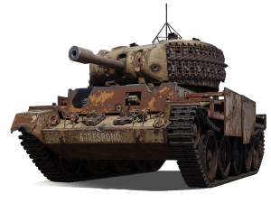 
     **Harbinger Mk. IV**  
     
    *Gun* 
    **DPM (with Standard ammo)** 3 397  **3 293** 
    **Damage (standard/premium)** 190/150  **200/160** 
    **Reload time** 3.36  **3.64**  
    *Health and armor* 
    **HP** 1 200  **1 300**  
     
    *Autoreloader* 
    **DPM (with Standard ammo)** 3 757  **4 067** 
    **Damage (standard/premium)** 240/190  **260/210**  
    *Reload speed* 
    **DPM (with Standard ammo)** 3 754  **4 361** 
    **Damage (standard/premium)** 210/170  **230/190** 
    **Reload time** 3.36  **3.16** 
    **Dispersion** 0.35  **0.38**  
     
    *Rotation speed* 
    **HP boost** 600  **700**  
    *Hitpoints* 
    **HP boost** 800  **900**  
     
    *Reload speed* 
    **DPM (with Standard ammo)** 5 562  **5 162** 
    **Reload time** 3.45  **3.84** 
    **Damage (standard/premium)** 320/240  **330/270**  
    *Autoreloader* 
    **DPM (with Standard ammo)** 5 284  **4 380** 
    **Damage (standard/premium)** 380/300  **420/340** 
    **Clip size** 4  **3** 
    **Reload time (starting with an empty clip)** 4.31/4.79/5.27/5.75  **5.75/6.23/6.71** 
    **Intra-clip reload** 3  **2** 
    **Clip damage** 1 520  **1 260**  
    *Damage per shot* 
    **DPM (with Standard ammo)** 4 505  **5 110** 
    **Damage (standard/premium)** 450/360  **490/400** 
    **Reload time** 5.99  **5.75** 
    ---
    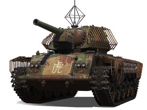 
     **Bái Láng**  
     
    *Gun* 
    **DPM (with Standard ammo)** 3 129  **3 313** 
    **Penetration (standard/premium)** 110/135  **100/125** 
    **Reload time** 3.45  **3.26**  
    *Mobility* 
    **Forward speed** 65  **70** 
    **Engine power** 630  **690**  
    *Health and armor* 
    **HP** 1 150  **1 000**  
     
    *Top speed* 
    **Forward speed** 80  **85** 
    **Engine power** 950  **1 045**  
    *Dynamics* 
    **Forward speed** 70  **75** 
    **Engine power** 1 260  **1 390**  
     
    *Reload speed* 
    **DPM (with Standard ammo)** 3 563  **4 112** 
    **Damage (standard/premium)** 205/165  **230/185** 
    **Reload time** 3.45  **3.36**  
    *Burst Autoloader* 
    **DPM (with Standard ammo)** 3 301   **3 146** 
    **Damage (standard/premium)** 125/100  **130/105** 
    **Reload time** 8.63  **9.88**  
     
    *Rotation speed* 
    **HP boost** 150  **300**  
    *Hitpoints* 
    **HP boost** 350  **500**  
     
    *Rotation speed* 
    **HP boost** 300  **600**  
    *Hitpoints* 
    **HP boost** 500  **700**  
     
    *Burst Autoloader* 
    **DPM (with Standard ammo)** 4 493  **3 260** 
    **Penetration (standard/premium)** 210/248  **200/238** 
    **Damage (standard/premium)** 145/120  **150/125** 
    **Reload time** 9.59  **12.46** 
    **Clip size** 4x2  **3x2**  
    *Reload speed* 
    **DPM (with Standard ammo)** 4 380  **4 849** 
    **Penetration (standard/premium)** 210/248  **200/238** 
    **Damage (standard/premium)** 350/280  **465/375** 
    **Reload time** 4.79  **5.75** 
    **Dispersion** 0.35  **0.38**  
    *HE-shell damage* 
    **DPM (with AP)** 4 172  **3 824** 
    **Damage (HE/AP)** 800/600  **800/550** 
    **Aim time** 3.36  **3.84** 
    ---
    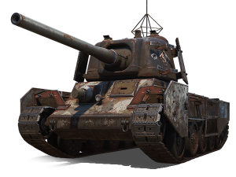 
     **Huragan**  
    *Abilities* 
    ***Electric Discharge:*** 
    **Maximum damage** 600  **625** 
    **Number of strikes** 6  **5** 
    **Damage per strike** 100  **125** 
    ***Surging Fervor:***  Electric Discharge doesn't charge it up.  
     
    *Gun* 
    **DPM (with Standard ammo)** 3 474  **3 105** 
    **Reload time** 5.75  **6.62**  
    *Mobility* 
    **Forward speed** 58  **62**  
    *Health and armor* 
    **HP** 1 200  **1 300**  
     
    *Top speed* 
    **Forward speed** 69  **73** 
    **Engine power** 1 100  **1 060**  
    *Dynamics* 
    **Forward speed** 62  **65** 
    **Engine power** 1 530  **1 450**  
     
    *Autoloader* 
    **DPM (with Standard ammo)** 3 377  **3 730** 
    **Reload time** 11.51  **9.59**  
    *Reload speed* 
    **DPM (with Standard ammo)** 3 851  **3 754** 
    **Reload time** 3.74  **3.84**  
     
    *Rotation speed* 
    **HP boost** 300  **400**  
    *Hitpoints* 
    **HP boost** 300  **400**  
     
    *Autoloader (lower alpha)* 
    **DPM (with Standard ammo)** 4 500  **4 419** 
    **Damage (standard/premium)** 230/180  **245/200** 
    **Reload time** 12.46  **14.29**  
    *Reload speed* 
    **DPM (with Standard ammo)** 4 693  **4 859** 
    **Damage (standard/premium)** 360/290  **365/290** 
    **Reload time** 4.6  **4.51**  
    *Autoloader (bigger alpha)* 
    **DPM (with Standard ammo)** 4 310  **4 560** 
    **Damage (standard/premium)** 320/260  **340/270**
    ---
    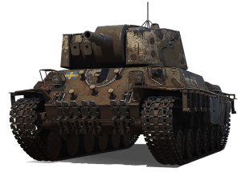 
     **Beowulf**  
     
    *Gun* 
    **DPM (with Standard ammo)** 3 003  **2 944** 
    **Reload time** 4.79  **4.89**  
    *Health and armor* 
    **HP** 1 300  **1 600**  
     
    *Autoloader* 
    **DPM (with Standard ammo)** 2 931  **3 473** 
    **Reload time** 13.42  **10.55**  
    *Reload speed* 
    **DPM (with Standard ammo)** 3 352  **3 542** 
    **Reload time** 5.37  **5.08**  
     
    *Hitpoints* 
    **HP boost** 800  **700**  
    *Armor* 
    **HP boost** 400  **300**  
     
    *Armor* 
    **HP boost** 300  **400**  
     
    *Autoloader (big alpha)* 
    **DPM (with Standard ammo)** 3 716  **4 288** 
    **Damage (standard/premium)** 580/470  **560/450** 
    **Reload time** 21.09  **11.51** 
    **Intra-clip reload** 3.5  **6**  
    *Autoloader (smaller alpha)* 
    **DPM (with Standard ammo)** 3 877  **4 084** 
    **Penetration (standard/premium)** 215/266  **205/256** 
    **Reload time** 17.26  **11.51** 
    **Intra-clip reload** 2.5  **4** 
    **Aim time** 2.21  **2.4**  
    *Reload speed* 
    **DPM (with Standard ammo)** 3 771  **4 236** 
    **Reload time** 7  **6.23** 

    
