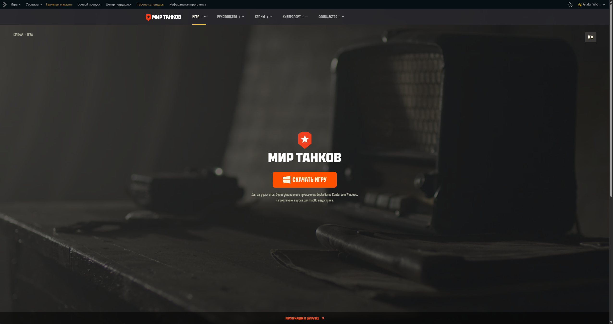

# Getting Started

> **Stay updated:**  
> For the latest info, updates, and community help, join our [Discord server](https://discord.gg/NstYRK8q8T).

---

## How to Get the Game

1. **Go to the official website:**  
   Download the game client from [Mir Tankov Website](https://tanki.su/ru/game/download/).  

   

2. **Install the game:**  
   Run the installer and follow the setup steps.

3. **Create an account:**  
   Sign up using your email, or log in if you already have an account;  
   If you don't go to [Mir Tankov Registeration Website](https://lesta.ru/registration/ru/?bonus_mode=TANKISU).

4. **Launch and play:**  
   Open the game, log in, and you’re ready to go.

---

## How to install the Translation

1. **Getting the Installer:**    
   Go to our [GitHub site](github.com/LocalizedTanki/Tanki-L10nManager/releases/latest) and download the latest version of the installer.

2. **Installing the mod:**    
   Run it, Accept the agreement and select the language you need (English by default);  
   And if you want your Game Center to get extra languages aswell.

---

## Need Help?

If you run into any issues installing or running the game, check our FAQ or hop onto the Discord—someone from the community is usually around to help.

---

## Next Steps

- [Beginner’s Guide](beginner-guide.md) (coming soon)
- [Troubleshooting](troubleshooting.md) (coming soon)
- [Game Basics](game-basics.md) (coming soon)
