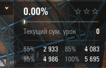

# Mods

!!! warning
    In here you will find popular and requested mods that work with Мир танков starting from 1.35.0.0 version
!!! tip
    Mod format can be changed from <code>.wotmod</code> to <code>.mtmod</code> manually via win explorer, however they might or might not work.

---

## **LeBwa Gunmarks Calculator**   

 As the name says, the mod calculates your Gunmark precentage 
 You can download the mod [here](https://raw.githubusercontent.com/LocalizedTanki/Tanki-L10n-mods/main/me.poliroid.gunmarks-lebwa_3.7.03.mtmod) 
 

---

## **Reticle size Remover**   

 Now you will be seeing your in-game Reticle in the actual size, without any restrictions to the max size 
 You can download the mod [here](https://raw.githubusercontent.com/LocalizedTanki/Tanki-L10n-mods/main/ReticleSizeLimitRemover_1.0.1_jeNJajG.mtmod) 
 

---

## **Extanded Blacklist**   

 This mode is supposed to extand your blacklist (if you would ever need more of it) 
 You can download the mod [here](https://raw.githubusercontent.com/LocalizedTanki/Tanki-L10n-mods/main/extended_blacklist.mtmod) 

---